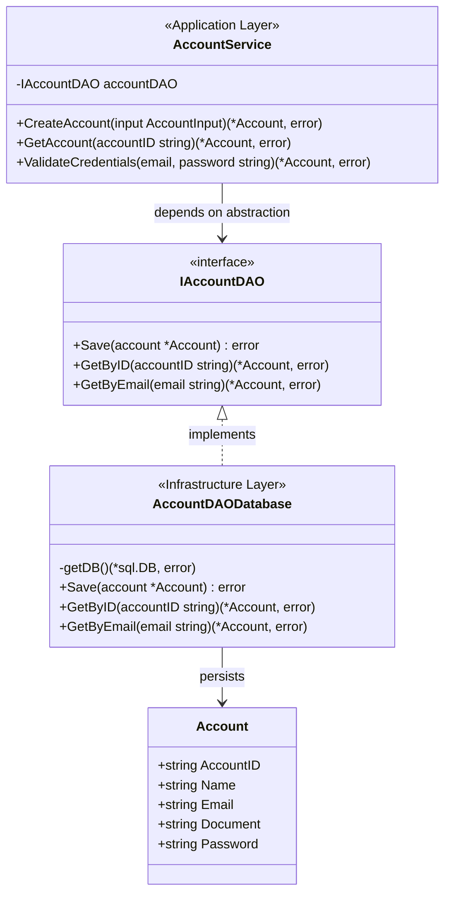

# Account Domain Class Diagram

This diagram shows the clean architecture implementation of the Account domain following the Repository Pattern and Dependency Inversion Principle.

## Architecture Principles Demonstrated

### Dependency Inversion Principle (DIP)
- `AccountService` depends on the `IAccountDAO` interface, not concrete implementations
- Business logic remains stable while storage implementations can vary

### Repository Pattern
- `IAccountDAO` abstracts data persistence concerns
- Enables testing with `AccountDAOMemory` and production with `AccountDAODatabase`

### Single Responsibility Principle
- **Account**: Domain entity with clear data structure
- **IAccountDAO**: Data access contract definition
- **AccountService**: Business logic orchestration
- Each DAO implementation handles one storage mechanism