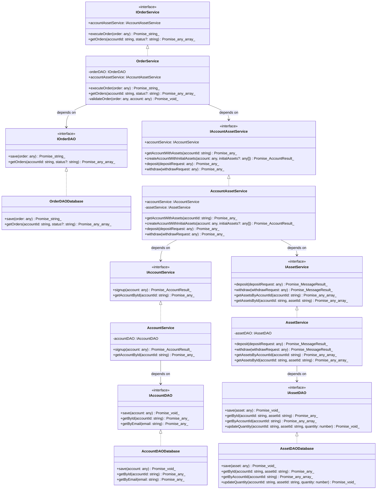

# Class Diagram - System Overview

This diagram provides an overview of the system architecture, illustrating the key components and their relationships.

```mermaid
classDiagram
    %% Domain Interfaces
    class IAccountDAO {
        <<interface>>
        +save(account: any) Promise_void_
        +getById(accountId: string) Promise_any_
        +getByEmail(email: string) Promise_any_
    }
    
    class IAssetDAO {
        <<interface>>
        +save(asset: any) Promise_void_
        +getById(accountId: string, assetId: string) Promise_any_
        +getByAccountId(accountId: string) Promise_any_array_
        +updateQuantity(accountId: string, assetId: string, quantity: number) Promise_void_
    }
    
    class IOrderDAO {
        <<interface>>
        +save(order: any) Promise_string_
        +getOrders(accountId: string, status?: string) Promise_any_array_
    }
    
    %% DAO Database Implementations
    class AccountDAODatabase {
        +save(account: any) Promise_void_
        +getById(accountId: string) Promise_any_
        +getByEmail(email: string) Promise_any_
    }
    
    class AssetDAODatabase {
        +save(asset: any) Promise_void_
        +getById(accountId: string, assetId: string) Promise_any_
        +getByAccountId(accountId: string) Promise_any_array_
        +updateQuantity(accountId: string, assetId: string, quantity: number) Promise_void_
    }
    
    class OrderDAODatabase {
        +save(order: any) Promise_string_
        +getOrders(accountId: string, status?: string) Promise_any_array_
    }
    
    %% Service Interfaces
    class IAccountService {
        <<interface>>
        +signup(account: any) Promise_AccountResult_
        +getAccountById(accountId: string) Promise_any_
    }
    
    class IAssetService {
        <<interface>>
        +deposit(depositRequest: any) Promise_MessageResult_
        +withdraw(withdrawRequest: any) Promise_MessageResult_
        +getAssetsByAccountId(accountId: string) Promise_any_array_
        +getAssetsById(accountId: string, assetId: string) Promise_any_array_
    }
    
    class IOrderService {
        <<interface>>
        +accountAssetService: IAccountAssetService
        +executeOrder(order: any) Promise_string_
        +getOrders(accountId: string, status?: string) Promise_any_array_
    }
    
    class IAccountAssetService {
        <<interface>>
        +accountService: IAccountService
        +getAccountWithAssets(accountId: string) Promise_any_
        +createAccountWithInitialAssets(account: any, initialAssets?: any[]) Promise_AccountResult_
        +deposit(depositRequest: any) Promise_any_
        +withdraw(withdrawRequest: any) Promise_any_
    }
    
    %% Service Implementations
    class AccountService {
        -accountDAO: IAccountDAO
        +signup(account: any) Promise_AccountResult_
        +getAccountById(accountId: string) Promise_any_
    }
    
    class AssetService {
        -assetDAO: IAssetDAO
        +deposit(depositRequest: any) Promise_MessageResult_
        +withdraw(withdrawRequest: any) Promise_MessageResult_
        +getAssetsByAccountId(accountId: string) Promise_any_array_
        +getAssetsById(accountId: string, assetId: string) Promise_any_array_
    }
    
    class OrderService {
        -orderDAO: IOrderDAO
        +accountAssetService: IAccountAssetService
        +executeOrder(order: any) Promise_string_
        +getOrders(accountId: string, status?: string) Promise_any_array_
        -validateOrder(order: any, account: any) Promise_void_
    }
    
    class AccountAssetService {
        +accountService: IAccountService
        -assetService: IAssetService
        +getAccountWithAssets(accountId: string) Promise_any_
        +createAccountWithInitialAssets(account: any, initialAssets?: any[]) Promise_AccountResult_
        +deposit(depositRequest: any) Promise_any_
        +withdraw(withdrawRequest: any) Promise_any_
    }
    
    %% Relationships - Interface Implementations
    IAccountDAO <|.. AccountDAODatabase
    IAssetDAO <|.. AssetDAODatabase
    IOrderDAO <|.. OrderDAODatabase
    IAccountService <|.. AccountService
    IAssetService <|.. AssetService
    IOrderService <|.. OrderService
    IAccountAssetService <|.. AccountAssetService
    
    %% Relationships - Dependencies
    AccountService --> IAccountDAO : depends on
    AssetService --> IAssetDAO : depends on
    OrderService --> IOrderDAO : depends on
    OrderService --> IAccountAssetService : depends on
    AccountAssetService --> IAccountService : depends on
    AccountAssetService --> IAssetService : depends on
```
